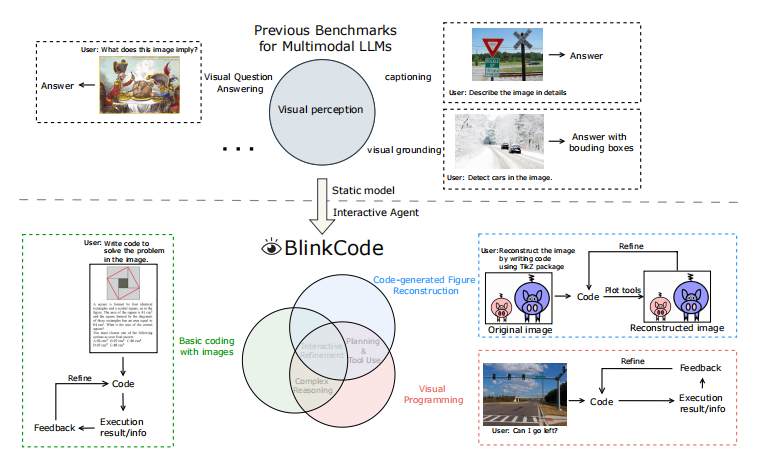

# BlinkCode: Benchmarking Multimodal Large Language Models

[How Well Can Multimodal LLMs Write Code as Vision-Enabled Agents?](arxiv link)
 
 
 
BlinkCode is an innovative benchmark designed to evaluate the coding capabilities of multimodal large language models (MLLMs) that act as vision-enabled agents. This benchmark consists of 1,000 coding problems, organized into 9 distinct tasks, and is designed to test various abilities including complex reasoning, planning, tool usage, and interactive refinement based on visual information.

## News
**[2024.6.xx]** [BlinkCode](arxiv link) is released! Data and evaluation code is available now.

## Leaderboard
Welcome to [BlinkCode](https://huggingface.co/spaces/AILab-CVC/SEED-Bench_Leaderboard)!

### Leaderboard Submission
待定
## Data Preparation

You can download the data of BlinkCode released on HuggingFace repo [BlinkCode](huggingface link).

## Installation

Please refer to [INSTALL.md](INSTALL.md).

## Run Evaluation

Please refer to [EVALUATION.md](EVALUATION.md).

## License
BlinkCode is released under the MIT License.

## Declaration
### Data Sources 
#### Basic Coding Problems:
- HumanEval-V: Adapted from the HumanEval Dataset (https://huggingface.co/datasets/openai/openai_humaneval) by writing problem descriptions directly on images.
- MBPP-V: Adapted from the MBPP Dataset (https://huggingface.co/datasets/google-research-datasets/mbpp), also with problem descriptions written on images.
- GSM8K-V: Adapted from the GSM8K Dataset (https://huggingface.co/datasets/openai/gsm8k), focusing on challenging competition mathematics problems with descriptions written on images.  

#### Math Problems:

- Math-V: Derived from the MATH Dataset (https://huggingface.co/datasets/MathLLMs/MathVision), including mathematical reasoning problems with visual contexts and descriptions written on images.

#### Visual Reconstruction Tasks:

- Webpage Reconstruction: Screenshots from a diverse collection of websites, ensuring each screenshot contains an appropriate amount of information for reconstruction.
- Scientific Plot Reconstruction: Examples plotted with Matplotlib from its official documentation, selected for diversity in types, styles, and contents.
- SVG Reconstruction: Basic graphics selected from online SVG examples.
- TikZ Figure Reconstruction: Examples selected from the PGF and TikZ examples gallery.

#### Visual Programming Problems:

- Custom Collected Images: For visual programming tasks, specific images were collected from the web, and corresponding special questions were designed such that the problems cannot be solved without observing the visual content of the images.

Please contact us if you believe any data infringes upon your rights, and we will remove it.

## Citing
If you find this repository helpful, please consider citing it:
```
our cite
```
