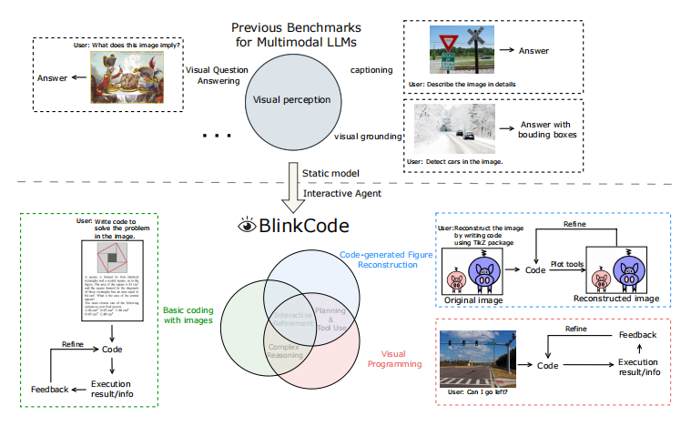

# BlinkCode: Benchmarking Multimodal Large Language Models🔥

[How Well Can Multimodal LLMs Write Code as Vision-Enabled Agents?](arxiv link)

 
 
BlinkCode is an innovative benchmark designed to evaluate the coding capabilities of multimodal large language models (MLLMs) that act as vision-enabled agents. This benchmark consists of 1,000 coding problems, organized into 9 distinct tasks, and is designed to test various abilities including complex reasoning, planning, tool usage, and interactive refinement based on visual information.  
[[🌐 Homepage](https://yjquantumleap.github.io/blinkcode-home-page/)] [[🤗 Huggingface Dataset](https://huggingface.co/datasets/yajuniverse/BlinkCode)] [[📊 Leaderboard ](https://huggingface.co/spaces/yajuniverse/BlinkCode_leaderboard)]  [[📖 ArXiv Paper](https://arxiv.org/pdf/2402.14804.pdf)]

## 💥News
**[2024.7.2]** [BlinkCode](arxiv link) is released! Data and evaluation code is available now.

## 🏆Leaderboard
Welcome to [BlinkCode](https://huggingface.co/spaces/yajuniverse/BlinkCode_leaderboard)!

## 🤗Data Preparation

You can download the data of BlinkCode released on HuggingFace repo [BlinkCode](https://huggingface.co/datasets/yajuniverse/BlinkCode).

## ⚙️Installation

Please refer to [INSTALL.md](INSTALL.md).

## 💻Run Evaluation
Please refer to [EVALUATION.md](EVALUATION.md).   

**Important:** Before running the evaluation, please review the [Execution Safety Warning](#🚨execution-safety-warning) below to understand the risks involved and the precautions that should be taken.  


## 🚨Execution Safety Warning
This program is designed to evaluate code generated by multimodal large language models. Running unverified code carries inherent risks. **To mitigate the security risks associated with executing untrusted code, it is strongly recommended to operate this program within a secure and isolated environment.** This may include, but is not limited to, the use of sandboxing technologies, virtual machines, or dedicated testing servers. Such measures ensure that the execution environment is isolated from the main operating environment, thereby protecting the main system from potential malicious code or inadvertent actions.

## 📜License
BlinkCode is released under the MIT License.

## 📢Declaration
### 📂Data Sources 
#### Basic Coding Problems:
- HumanEval-V: HumanEval Dataset (https://github.com/openai/human-eval) under its license (https://github.com/openai/human-eval/blob/master/LICENSE). Copyright belongs to the original dataset owner.
- MBPP-V: MBPP Dataset (https://huggingface.co/datasets/google-research-datasets/mbpp) under its license (https://github.com/google-research/google-research/blob/master/LICENSE). Copyright belongs to the original dataset owner.
- GSM8K-V: GSM8K Dataset (https://github.com/openai/grade-school-math) under its license (https://github.com/openai/grade-school-math/blob/master/LICENSE). Copyright belongs to the original dataset owner.

#### Math Problems:

- Math-V: MATH-V Dataset (https://github.com/mathvision-cuhk/MATH-V) under its license (https://github.com/mathvision-cuhk/MATH-V/blob/main/LICENSE). Copyright belongs to the original dataset owner.

#### Visual Reconstruction Tasks:

- Webpage Reconstruction: Screenshots from a diverse collection of websites.
- Scientific Plot Reconstruction: Examples plotted with Matplotlib from its official documentation, selected for diversity in types, styles, and contents.
- SVG Reconstruction: Basic graphics selected from online SVG examples.
- TikZ Figure Reconstruction: Examples selected from the PGF and TikZ examples gallery.

#### Visual Programming Problems:

- Custom Collected Images: For visual programming tasks, specific images were collected from the web, and corresponding special questions were designed such that the problems cannot be solved without observing the visual content of the images.

Please contact us if you believe any data infringes upon your rights, and we will remove it.

### ⚠️Content Disclaimer
The screenshots and code used in Visual Reconstruction Tasks and Visual Programming Problems are sourced from publicly accessible materials or are used under appropriate licenses for academic research purposes. This project does not assert ownership of these materials and acknowledges the rights of their respective owners.


All efforts have been made to ensure compliance with copyright laws and permissions. If you believe that your rights have been infringed upon, please contact us immediately so that we can resolve the issue promptly.

## 📝Citation
If you find this repository helpful, please consider citing it:
```
our cite
```
## 🙏Acknowledgements

We gratefully acknowledge the following individuals and projects whose work has inspired or directly contributed to the development of our current codebase:

- **Humaneval:** Our evaluation methods have been inspired by OpenAI's Humaneval project.

- **ViperGPT:** We have incorporated code structures from ViperGPT into our implementation.

These contributions have been instrumental in shaping our current implementation, and we extend our sincere thanks to the respective creators and contributors.